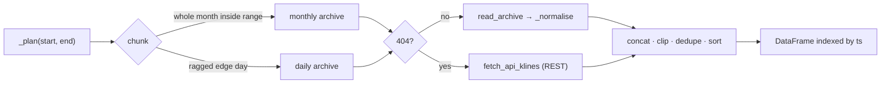

# Klines (OHLCV)

**Module:** `data_collection.klines` · [reference](../reference/klines.md)
**Markets:** `spot` (intervals from 1s) or `um` USDⓈ-M futures (intervals from 1m)
**Output:** `data/parquet/{SYMBOL}_{market}_{interval}_{START}_{END}.parquet`

Candles for any `[start, end)` range, indexed by UTC open time. Archives where they exist,
REST for the tail that has no archive yet. `data_collection/binance_1s.ipynb` is the walkthrough this was
extracted from.

```bash
python -m data_collection.klines --symbol BTCUSDT --interval 1s --start 2026-09-01 --end 2026-09-04
python -m data_collection.klines --market um --interval 1m --start 2026-09-01 --end 2026-09-04
```

```python
from datetime import datetime, timezone
from data_collection.klines import get_klines, to_regular_grid

df = get_klines("BTCUSDT", datetime(2026, 9, 1, tzinfo=timezone.utc),
                datetime(2026, 9, 4, tzinfo=timezone.utc), interval="1s", market="spot")
```

## Sources

| Source | Covers | Throughput |
|---|---|---|
| `data.binance.vision` archives | Everything up to ~1 day ago. Spot 1s klines exist back to 2017-08. | ~2.6M rows per monthly 1s file, one request |
| REST `/api/v3/klines` (spot) or `/fapi/v1/klines` (um) | The last day or two | 1000 candles per request |

Archive URL layout:

```
https://data.binance.vision/data/spot/daily/klines/BTCUSDT/1s/BTCUSDT-1s-2026-09-07.zip
https://data.binance.vision/data/spot/monthly/klines/BTCUSDT/1s/BTCUSDT-1s-2026-08.zip
https://data.binance.vision/data/futures/um/daily/klines/BTCUSDT/1m/BTCUSDT-1m-2026-09-07.zip
```

## Pipeline



1. **`_plan`** splits the range into archive chunks — a monthly archive wherever a whole calendar
   month lies inside the range, daily archives for the ragged edges.
2. **`_load_chunk`** downloads the archive (cached in `data/raw/`, SHA-256 verified). On 404 it
   falls back to REST for exactly that chunk's window.
3. **`get_klines`** runs chunks 4-wide in a thread pool, concatenates, clips to `[start, end)`,
   drops duplicate `open_time`s and sorts.

## Schema

| Column | Type | Notes |
|---|---|---|
| `ts` (index) | `datetime64[ns, UTC]` | = `open_time` |
| `open_time`, `close_time` | `int64` | Epoch **milliseconds**, normalised (see [quirks](../notes/binance-quirks.md)) |
| `open`, `high`, `low`, `close` | `float64` | Quote currency |
| `volume` | `float64` | Base asset (BTC) |
| `quote_volume` | `float64` | Quote currency |
| `trades` | `int64` | Trade count in the bar |
| `taker_buy_base`, `taker_buy_quote` | `float64` | Taker-buy volume |

Binance's trailing `ignore` column is dropped. Everything is derived from executed trades —
there is no book information in klines.

## Gaps

Binance emits a bar only when at least one trade printed in it, so a raw pull is **not** a
contiguous series. `to_regular_grid(df, interval)` reindexes onto a strict grid: `close` is
forward-filled, `open`/`high`/`low` take the carried close, and flow columns are zeroed. Use it
when a model needs fixed-cadence input; keep the raw frame when the absence of trades is itself
information.

## Rate limits

- The archive host is unmetered.
- REST allows 6000 weight/min per IP (spot). `fetch_api_klines` reads `x-mbx-used-weight-1m`,
  sleeps when above 4000, and honours `Retry-After` on 418/429. Chunks fetched from REST still
  run inside the 4-wide pool, so keep `MAX_DL_WORKERS` modest.

## Scaling up

A year of 1s `BTCUSDT` is ~31M rows, 400–600 MB as zstd Parquet — too large to hold as one
DataFrame alongside anything else. Pull month by month and write one file per month:

```python
import pandas as pd
from pathlib import Path
from data_collection.klines import get_klines

for m in pd.date_range("2024-01-01", "2025-01-01", freq="MS", tz="UTC")[:-1]:
    nxt = m + pd.offsets.MonthBegin(1)
    part = get_klines("BTCUSDT", m.to_pydatetime(), nxt.to_pydatetime(), "1s", verbose=False)
    part.to_parquet(Path("data/parquet") / f"BTCUSDT_spot_1s_{m:%Y%m}.parquet", compression="zstd")
```

Then read the directory lazily with `pyarrow.dataset`, `duckdb`, or `polars.scan_parquet`.

## On "USD"

Binance.com's BTC/USD pair is `BTCUSDT` (Tether) — the deepest book and the one with full 1s
history. `BTCUSDC` and `BTCFDUSD` also have 1s archives. A true `BTCUSD` pair only exists on
Binance.US, a separate venue with thinner liquidity and a different archive host.
